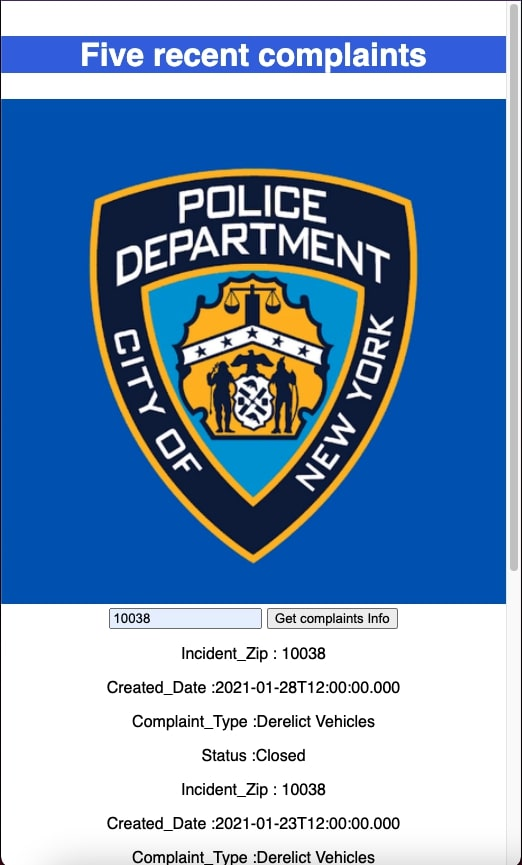
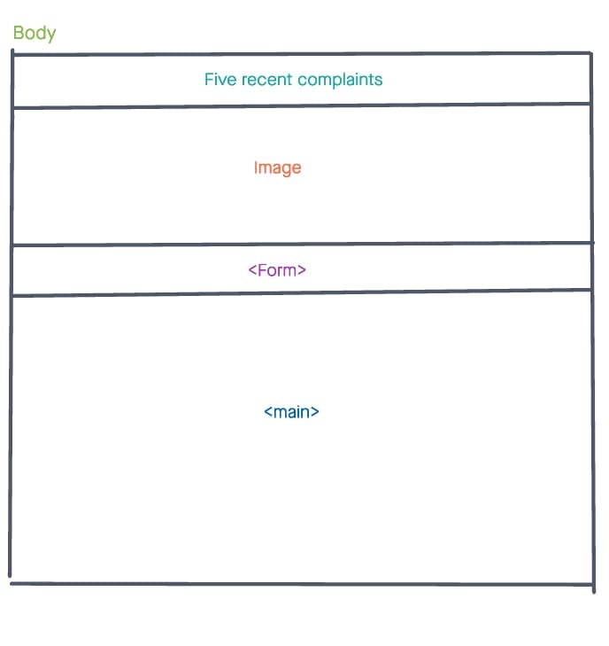

Five recents complaints
-------------------------------------------------------------------------------

It's an app that display five recents complaints reported in New York city by typing the zip code.

Technologies Used
-------------------------------------------------------------------------------

- HTML
- CSS
- JavaScript
- jQuery
- Hosted on Vercel
- AJAX used to receive data from ana external source NYPDapi.
- NYPD API

Screenshot
-------------------------------------------------------------------------------

Getting Started
-------------------------------------------------------------------------------
 [click here](https://vercel.com/nypdapi/project-one) to see the deployed app!

Future Enhancements
-------------------------------------------------------------------------------
I want to be able to make the app display the complaints description when a user type in the number of recent complaints.

